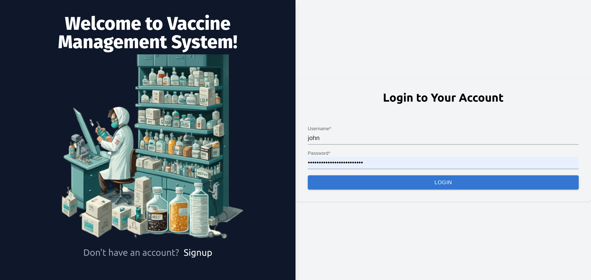
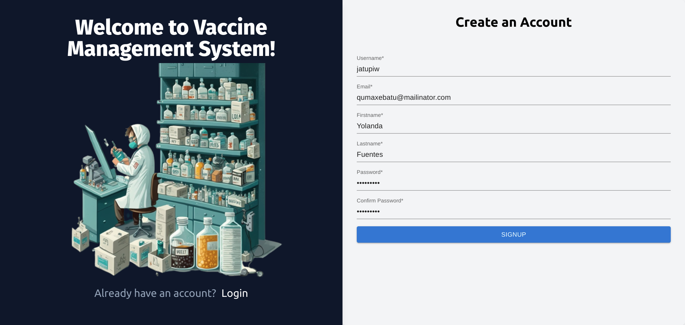
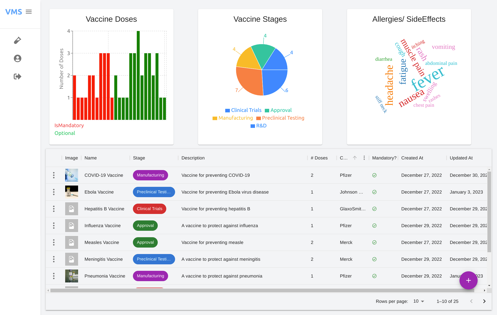
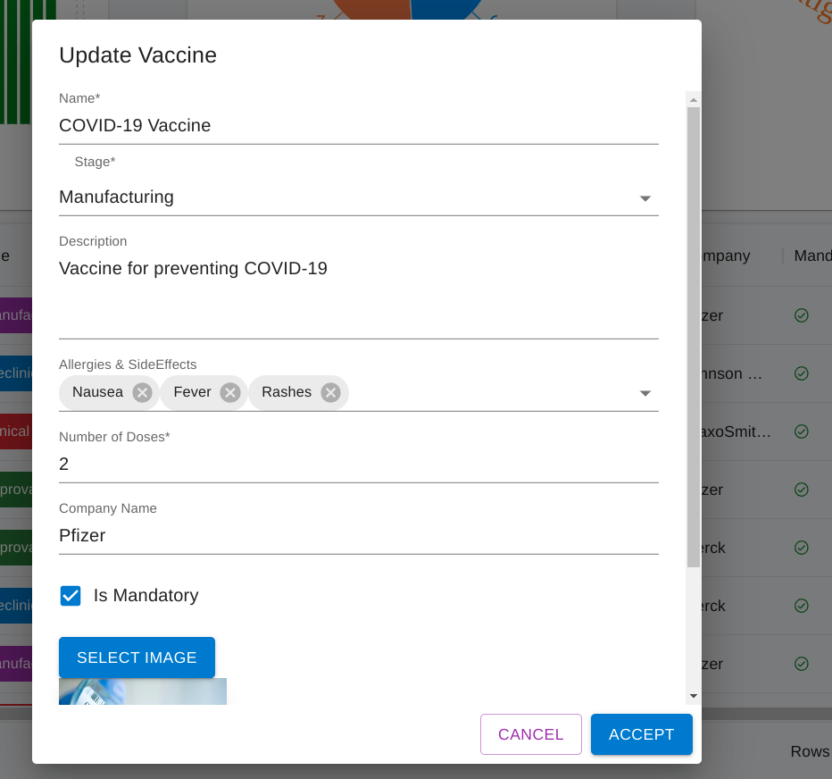

# Vaccine Management System

A React application for a Vaccine Management System. With this app, users can add vaccines with information such as name, dose, stage, company, and image URL. The vaccines can then be viewed in a table. The app also includes a dashboard featuring a pie chart for vaccine stages, a word cloud for allergies, and a bar chart for vaccine vs dose count.


## Screenshots
|  |  |
|--|--|
|  |  |


## Live Demo

A live demo of the app is available at [https://vaccine-fe-static.onrender.com/signin](https://vaccine-fe-static.onrender.com/signin). Please note that since the app is hosted in the free tier, you may experience a cold start.

## Tech Stack

-   [React](https://reactjs.org/)
-   [TypeScript](https://www.typescriptlang.org/)
-   [Material UI](https://material-ui.com/)
-   [Redux Toolkit](https://redux-toolkit.js.org/)
-   [Formik](https://formik.org/)
-   [Yup](https://github.com/jquense/yup)
-   [Recharts](http://recharts.org/)
-   [React Router](https://reactrouter.com/)
-   [Axios](https://github.com/axios/axios)
-   [Jest](https://jestjs.io/)
-   [React Testing Library](https://testing-library.com/docs/react-testing-library/intro)

## Development

To get started with development, clone the repository and install dependencies:

```bash
git clone git@github.com:Bishalsarang/Vaccine-Management-System-frontend.git
```

```bash
yarn install
```

To use the app, you will need to set the `REACT_APP_API_BASE_URL` environment variable to the base URL of the vaccine management REST API. This can be done in a `.env` file in the root of the project, like so:

`REACT_APP_API_BASE_URL='http://localhost:3000/api/v1'` 

Alternatively, you can set the environment variable in your environment or in the terminal before starting the development server:

```bash
export REACT_APP_API_BASE_URL='http://localhost:3000/api/v1
``` 

Then, start the development server with:

```bash
yarn start
``` 
This will start the development server at [http://localhost:3000](http://localhost:3000/). Any changes made to the code will automatically be reflected in the browser.

## Running Tests

To run tests, use the following command:

```bash
yarn test
``` 

To run tests with coverage, use the following command:

```bash
yarn test -- --coverage --watchAll=false
```
## Building and Deployment

To build the app for production, use the following command:

```bash
yarn build
``` 
This will create a `build` directory .


## License

This project is licensed under the MIT License. See the [LICENSE](https://chat.openai.com/LICENSE) file for details.